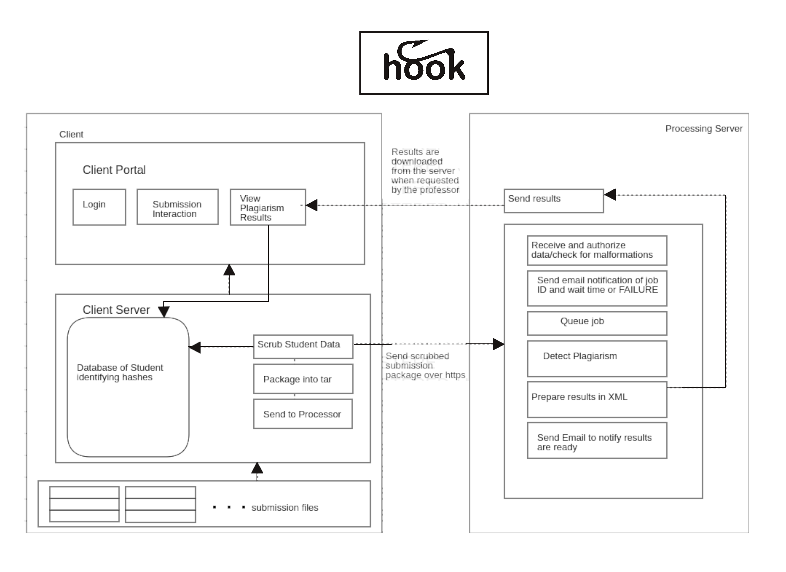

# Technical Specification of the Hook System

## Requirements Specification

The full requirements specification can be found [here](https://docs.google.com/document/d/1UVVvnKdHkklnPhdN2hNXOVsAdLhwPS8wMxeZy3kBFrw/edit)


## Maintenance Manual

This manual aims to provide resources and information for maintainers of the
hook system. As mentioned above, the [requirements specification](https://docs.google.com/document/d/1UVVvnKdHkklnPhdN2hNXOVsAdLhwPS8wMxeZy3kBFrw/edit) can be referred
to for expected behaviour, system features, external interface requirements,
other non-functional requirements, uses cases and  architecture diagrams.

### Quick Links:

[Processing Server Maintenance](#processing-server)


[Client Server Maintenance](#client-server)

#### Architecture Diagrams
<!-- .element height="20%" width="20%" -->


### Processing Server

Updates and bug fixes to the processing server can be made by forking the processing server repository, making changes on the local branch and opening a Pull Request against the master branch. Once a pull request has passed all tests, it should be safe
to sync with the live server.  Ideally, any new script or functionality added to the processing server should have an appropriate test file added in the same pull request. The processing server is currently pointing to the chloroplasts main master branch and pulls updates from this github repo. At
present, this must be done manually. Changes to the processing server, once
merged into the master branch, require logging into the server, navigating to
the root of the chloroplasts repo and calling:

```
git fetch upstream master
```

This will fetch all of the changes from the upstream master branch. Some configuration files
should remain unchanged, so the best way to sync the server with the upstream
changes is with:

```
git reset upstream/master
```

You can call:

```
git status
```
to ensure that your uniquely configured files are the only files that are
tracked as differing from the upstream branch.

This should be enough to see the new behaviour in the processing server but to
ensure the new commits are reflected, it is safest to call:

```
sudo systemctl restart apache2
```


#### Failures

In the case of unexpected behaviour, the log in `<src>/processor` of the server
should be the first place you check for errors. The output here should give you
an indication of what caused the problem or at least, the last processes that
were run by the server.

- If the processing server fails for any reason, a good first step is to try
  restarting apache:

  ```
  sudo systemctl restart apache2
  ```

A known issue that has required this command:

- In trials using a gmail address to notify users of their results being ready,
  the smtp server would occasionally throw an error and fail to send emails.
  This is being handled with a try catch to ensure the system still runs in the
  event of a failure to send email but this does not solve the problem of emails failing to send.
  Ideally this could be rectified with a retry mechanism. This is being tracked
  in issue #141.

#### Removal of old Results

Occasionally results should be removed from the processor. We recommend
creating a cron job to remove any results that are greater than 120 days old
and we are tracking this as issue #147

#### License Renewal and Management

Occasionally requests should be made to an institution's systems administrator to renew their licence
with Hook. This is primarily to ensure that contact information is up to date,
that all instructors on record with Hook are still active in the institution
and that the institution is running the most up to date version of the system.
We are tracking an issue to automate this process #148

### Client Server

Updates and bug fixes to the client server can be made by forking the client server repository, making changes on your local branch and opening a Pull Request against the master branch. Once a pull request has passed all tests, it should be safe to merge and sync with the live client server. Ideally, any new script or functionality added to the client server should have an appropriate test file added in the same pull request. The client server is currently pointing to the chloroplasts main master branch and pulls updates from this github repo. At present, this must be done manually. Changes to the client server, once
merged into the master branch, require logging into the server, navigating to
the root of the chloroplasts repo and calling:

```
git fetch upstream master
```

This will fetch all of the changes from the upstream master branch. Some configuration files
should remain unchanged, so the best way to sync the server with the upstream
changes is with:

```
git reset upstream/master
```

You can call:

```
git status
```

to ensure that your uniquely configured files are the only files that are
tracked as differing from the upstream branch.
Next run:

```
dotnet publish -c Release
```

then copy the contents of the `publish` folder on your computer into the `/var/www/ClientServer` on the server, overwriting any existing files. Restart the service with:

```
sudo systemctl stop kestrel-ClientServer.service
sudo systemctl start kestrel-ClientServer.service
```

#### Failures

In the case of unexpected behaviour, or Internal Server Errors, the error log can be viewed by running

```
sudo journalctl -fu kestrel-ClientServer.service --since "2016-10-18" --until "2016-10-18 04:00"
```

replacing the dates with the time range in which the error occurred. The output here should give you
an indication of what caused the problem or at least, the last processes that
were run by the server.
