# User Manual for Hook System

# Contents

[Login](#login-page)

- [How to Use the Login](#how-to-use-the-login-page)

[Current Courses Page](#current-courses-page)

- [How to Use the Current Courses Page](#how-to-use-the-current-courses-page)

[Search Courses Page](#search-courses-page)

- [How to Use the Search Courses Page](#how-to-use-the-search-courses-page)

[New Course Page](#new-course-page)

- [How to Use the New Course Page](#how-to-use-the-new-course-page)

[Edit Course Page](#edit-course-page)

- [How to Use the Edit Course Page](#how-to-use-the-edit-course-page)

[View Submissions Page](#view-submissions-page)

- [How to Use the View Submissions Page](#how-to-use-the-view-submissions-page)

[Upload Page](#upload-page)

- [How to Use the Upload Page](#how-to-use-the-upload-page)

[New Hook Job Page](#new-hook-job-page)

- [How to Use the New Hook Job Page](#how-to-use-the-new-hook-job-page)

[View Results Page](#view-results-page)

- [How to Use the View Results Page](#how-to-use-the-view-results-page)

## Login Page

The Login Page allows users to login in order to view their courses and files that they have stored on the client server/client portal. When the user logs in, they will  be able to view courses that belong to them.  The system ensures that the instructor user environment is personalized and private. This means that their courses and submissions are not shared with other instructors at the same institution.  The user may logout by clicking the Logout link on the side navigation pane.

### How to Use the Login Page

The Login Page is the first page that a user sees when they navigate to our application. Users will first need to have an account created by the system administrator at their institution. This will provide each user with a username, which is the user email address, and a password. The password  must be eight characters or more, contain at least one upper case letter, at least one number, and a special character.
Attempting to log on without entering a username and/or a password, will cause an error to appear, and  will prompt the user to enter the missing information. If the username/password is incorrect, another error will appear to inform the user of their error.
If everything is entered correctly, and the `Login` button is clicked, the user should be presented with the dashboard/ current courses page.

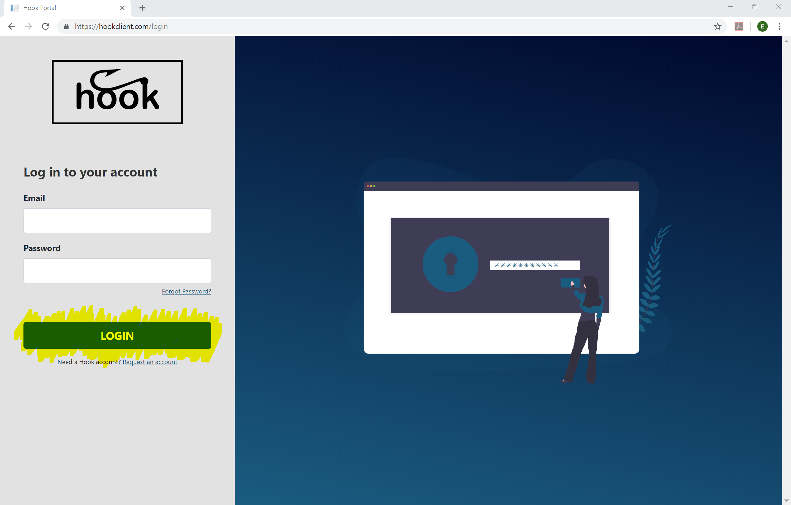<!-- .element align="center" height="100%" width="100%" -->

## Current Courses Page

The current course page is the landing page once the user logs into the application. This page was created so that the user can easily find the courses that they are currently teaching. From the current course page, the user can easily add more assignments to a course, and view student submissions for each assignment.

### How to Use the Current Courses Page

The courses are conveniently separated by program code (ex. COSC or APCO). This page is also used as the dashboard for the professor. Users can edit current courses by clicking the pencil icon on the top right-hand corner of each class (an example is highlighted in yellow below). Users may also view the submissions for each assignment by clicking the assignment name (an example of this is highlighted in yellow below).

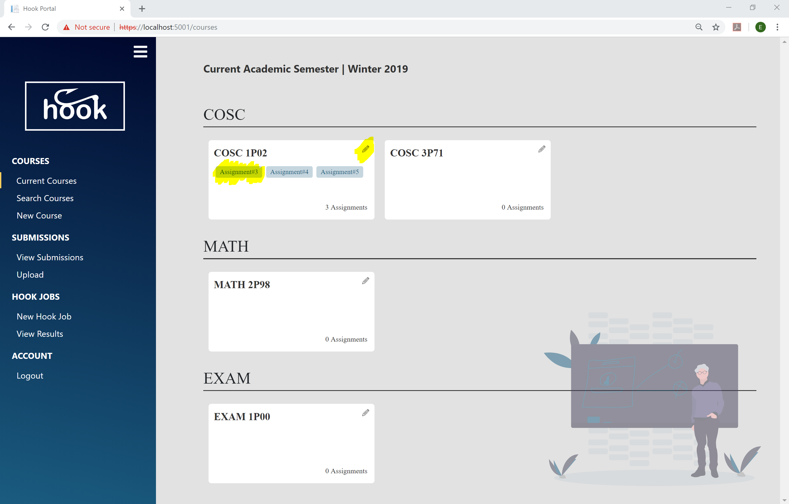<!-- .element align="center" height="100%" width="100%" -->

## Search Courses Page

The search course page is where all  courses  taught by the user (professor), past, present  and future, can be searched.

### How to Use the Search Courses Page

To search for a course,  simply enter its year, semester, program code, and course code. The courses matching the options will be filtered as the information is filled in, so there is no need to fill out all categories. Once the desired course appears, the same options can be performed as in the current courses page. Courses can be edited by clicking on the pencil icon on the top right-hand corner of that class, and assignment  submissions can be viewed for any assignment by clicking the assignment name – similar to the current courses.

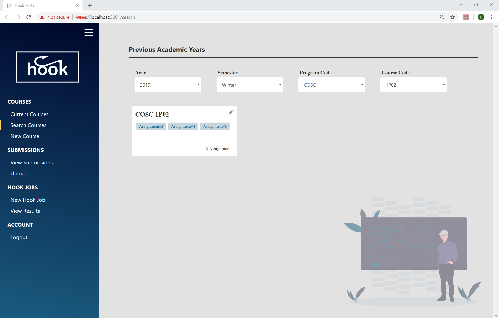<!-- .element align="center" height="100%" width="100%" -->

## New Course Page

The purpose of the New Course Page is to add a course to the user’s account. The user can create a course that is currently being taught or add a course for an upcoming semester.

### How to Use the New Course Page

To create a new course, the user must input the year, semester, program code, and course code and click the Create button. After the Create button is clicked, the site will redirect to the current courses page.

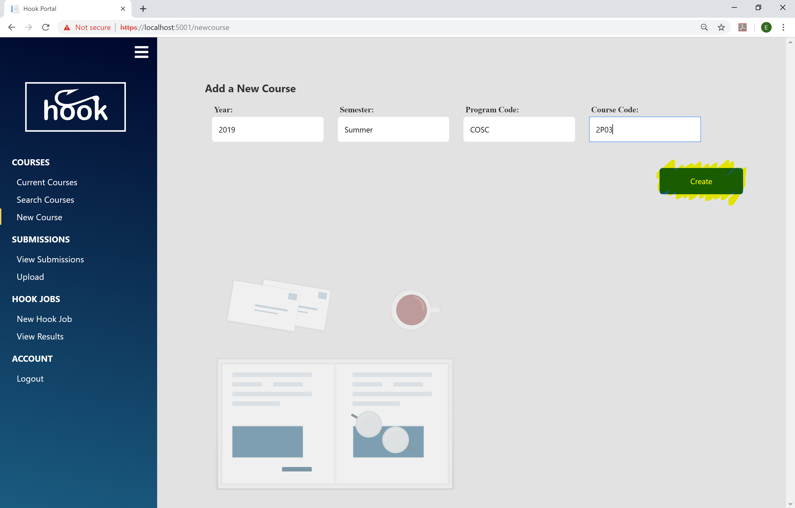<!-- .element align="center" height="100%" width="100%" -->

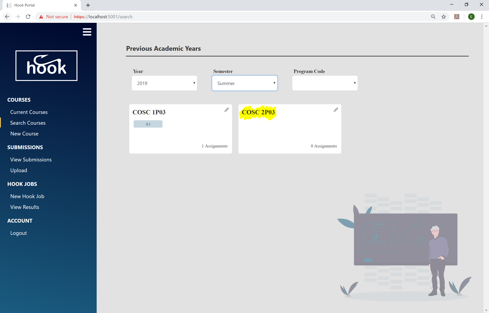<!-- .element align="center" height="100%" width="100%" -->

If the user wishes to add assignments to the course, this can be done by first searching for the course then clicking the pencil icon relating to that course. See Edit Course Page section for details.

## Edit Course Page

The purpose of the Edit Course Page is to update the information relating to the course, this includes assignments as well. It mimics the New Course Page but pre-populates the data of the course to be edited.

### How to Use the Edit Course Page

Course details can be updated by simply re-entering the data that needs to be changed. For example, if the course was supposed to be held in the Fall semester but it changed to the Winter semester, the user does not need to delete the course and re-create it. The user can just update the semester in the Edit Course Page, and then click the `Update` button.

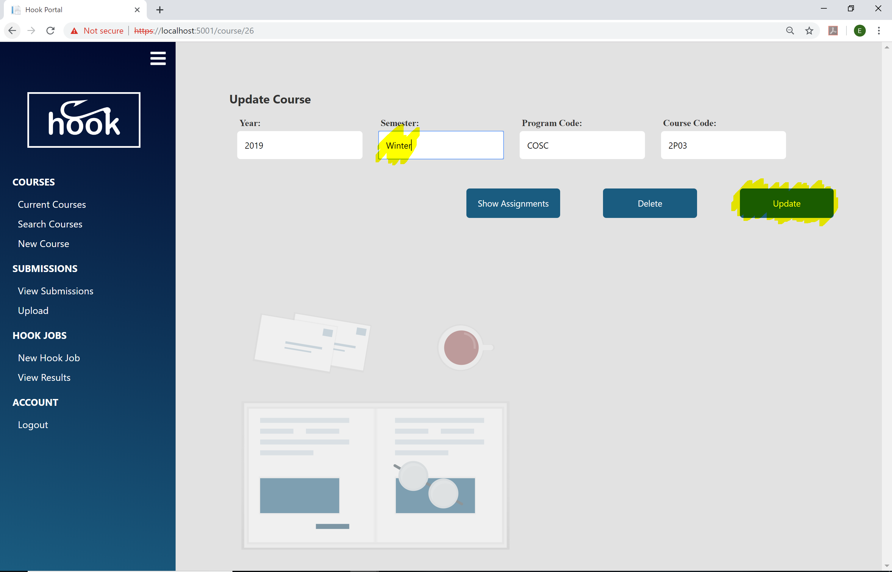<!-- .element align="center" height="100%" width="100%" -->

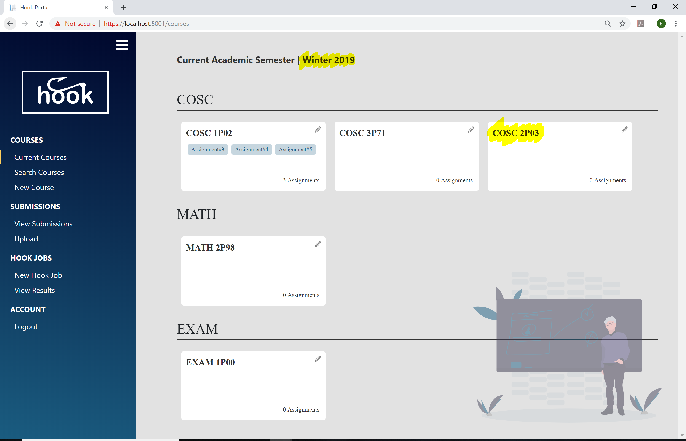<!-- .element align="center" height="100%" width="100%" -->

 To delete a course altogether, simply click the `Delete` button.
To add/remove/update an assignment to a course, click the `Show Assignments` button to see the assignments currently associated with the course. Note, once the assignments appear on the UI, the `Show Assignments` button will change to the `Hide Assignments` button, which will hide the assignments from the user.

<!-- .element align="center" height="100%" width="100%" -->

Click the `Add Assignment` button to add another assignment. The Assignment Name, Open Date and Close Date inputs will appear. After the assignment information is entered, click the `Create/Upload` button beside the assignment you want to create.
To update an assignment, re-enter the information and click the ‘Create/Upload’ button beside the assignment to be updated.

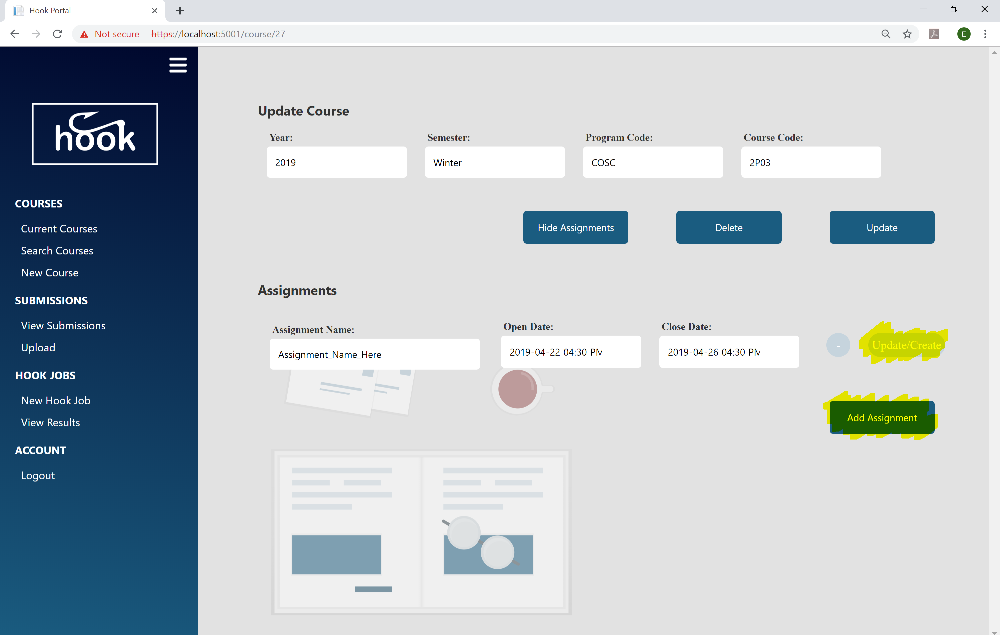<!-- .element align="center" height="100%" width="100%" -->

To delete an assignment, click the ‘-‘ button beside the assignment to be deleted.

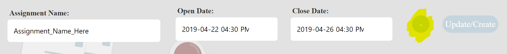<!-- .element align="center" height="100%" width="100%" -->

## View Submissions Page

The purpose of the View Submissions Page is to view the submissions for a particular assignment. The submissions shown will be the un-scrubbed submissions that the student handed in.

### How to Use the View Submissions Page

To view a student’s submissions for a particular assignment, the user will have to use the year, semester, program code, course code, and assignment drop down filters to select the desired assignment. The student submissions relating to this assignment will be listed on the left hand side of the page. The right hand side will show the contents of the chosen student submission. This will work as a File Explorer Window.

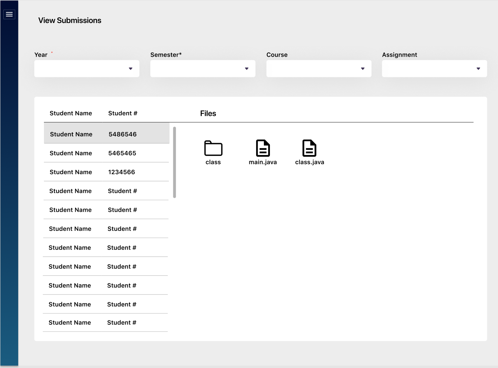<!-- .element align="center" height="100%" width="100%" -->

From here, the user may select to see the contents of a folder, or see a file. If the folder is selected then the breadcrumb navigation is updated to show the hierarchy of the current folder, and the user may only see the contents of that folder. If the file is selected, then the breadcrumb navigation is also updated to show what file is being viewed, and the File Explorer Window will convert into a File Viewer.

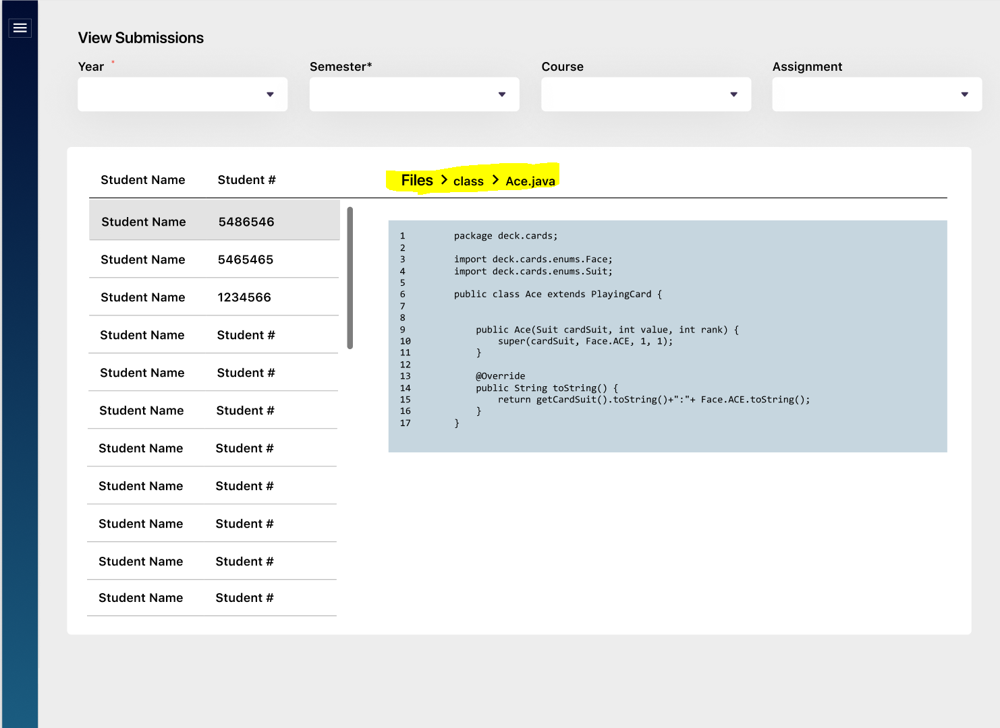<!-- .element align="center" height="100%" width="100%" -->

Note: to travel up the folder hierarchy, the user must simply click the folder that they would like to see the contents of.

## Upload Page

The purpose of the upload page is to manually update assignment submissions for a particular assignment. This is used if the professor did not set up the submission script to automatically direct a copy of the assignment submissions to the client server.

### How to Use the Upload Page

To upload assignment submissions for an assignment, simply drill down to the assignment by filling out the year, semester, program code, course code and the assignment. This is similar to the inputs for the Search Course page. After the assignment has been selected, a zip file containing the assignment submission should be added.

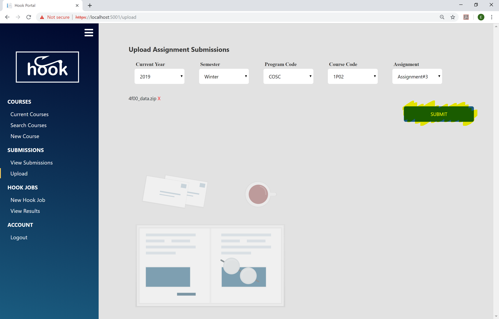<!-- .element align="center" height="100%" width="100%" -->

One way to add the assignment submissions is by dragging and dropping the zip file into the file drop zone.

The other way to add the assignment submissions is by clicking the ‘browse’ link in the file drop zone. This will make the File Explorer Window appear, so the user can attach the zip file by searching the computer.

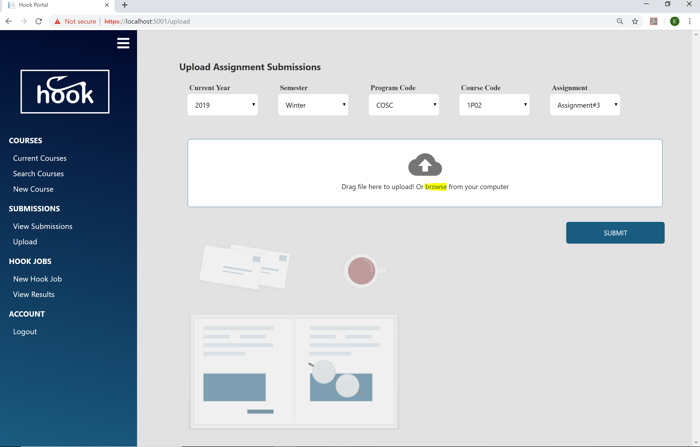<!-- .element align="center" height="100%" width="100%" -->

Since the backend is only expecting one folder, once the zip folder is added, the file drop zone will disappear and the name of the zip file will be displayed on the screen.
If the user accidentally attaches the incorrect zip folder, the user can delete the folder they attached by clicking the red ‘X’ button beside the folder name. Once this button is clicked, the file drop zone will appear again.

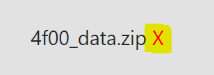<!-- .element align="center" height="100%" width="100%" -->

Once all the data is correct, the user can click the ‘Submit’ button to submit the assignment submissions to the assignment.

## New Hook Job Page

The purpose of the New Hook Job Page is to submit assignment submissions to the processing server to be run through the plagiarism detection algorithm and be flagged for potential plagiarism. As well as a set of submissions being compared against one another, new submissions can be compared with previous submissions and the user can also submit any number of ‘exclusions’ which, if encountered, will not be flagged as plagiarism.

### How to Use the New Hook Job Page

To submit a job to the processing server, the user must select a current submission to test for plagiarism by narrowing down the drop down inputs – similar to the Upload Page. Once a submission has been selected, a `+` button will appear under the `Previous Years` section.

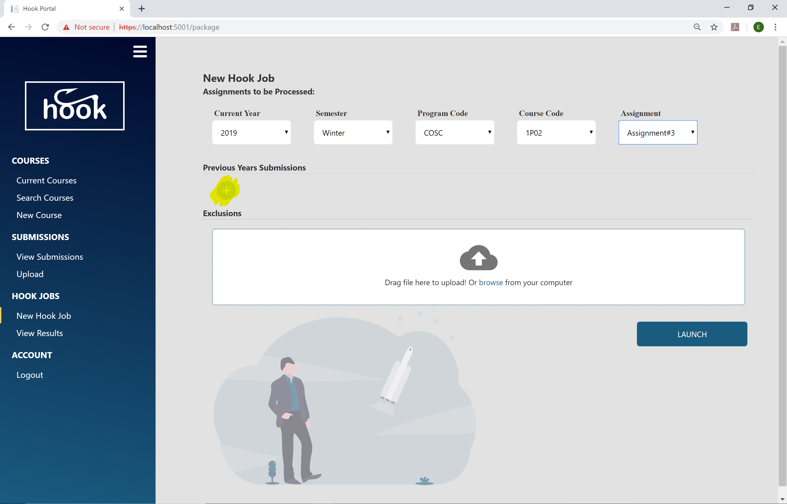<!-- .element align="center" height="100%" width="100%" -->

The user then has the option to add the assignment submissions from previous years for comparison. To add a submission to compare the current submissions to, simply click the `+` button so that a similar selection form appears. Once a previous submission is selected, click the checkmark button to finalize the selection. Note that the submission will not be sent to the processing server if the checkmark button is not clicked.

<!-- .element align="center" height="100%" width="100%" -->

Once the previous submission has been added, a minus button will appear beside the submission description on the page. To delete the previous submission, simply click the minus button.
To add more previous submissions simply repeat this process

<!-- .element align="center" height="100%" width="100%" -->

Multiple files of boiler plate code, formatted as .java, .cpp. or .c files, can be added in the Exclusions section of the page. To add this boiler plate code for the algorithm to ignore when processing the files, simply drag and drop the files into the file drop zone or click the browser link to search for the files in the File Explorer Window. If an incorrect file is added accidentally, simply click the red `X` button that appears next to the files name on the UI, similar to the New Hook Job Page.

Finally, when all the information is entered correctly, click the `Launch` button to send the request to the processing server.

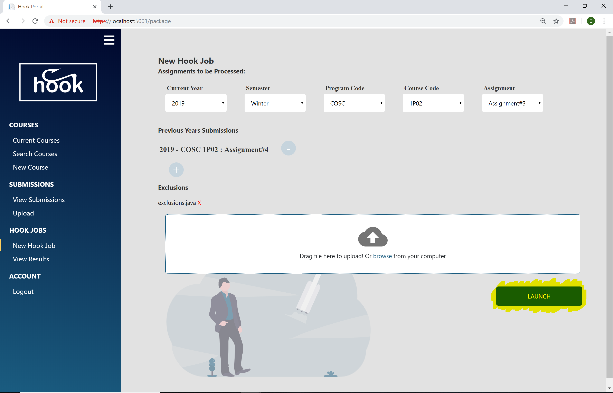<!-- .element align="center" height="100%" width="100%" -->

## View Results Page

The purpose of the View Results Page is to view the results given by the processing server, and to view the code lines that are potentially plagiarized.

### How to Use the View Results Page

When the user is first directed to the results page they are presented with a table of all the jobs that they have sent to the processing server. Each job will have a status: green for completed, yellow for queued, or red for error. The matches column will give a summary of how many matches were found in that job.

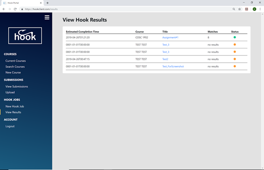<!-- .element align="center" height="100%" width="100%" -->

Once the job that was submitted is completed, the user can click the job name. This will bring the user to the results for that job. The user is presented with a list of matches found by the processing server. Each match will give a percentage of how much of the files are plagiarized, and the number of lines that are plagiarized.

<!-- .element align="center" height="100%" width="100%" -->

Clicking on one of the matches will expand the match to show the individual student files in which matches were detected, with the matching lines detected by the algorithm  as potential plagiarism highlighted in red.

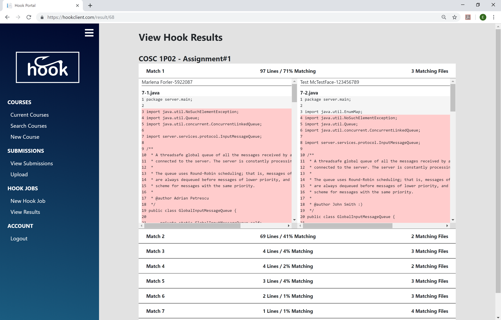<!-- .element align="center"
height="100%" width="100%" -->

Note that if there is a match between more than two students, the user will be able to pick the students from a drop down at the top of the file to compare two students side by side.
